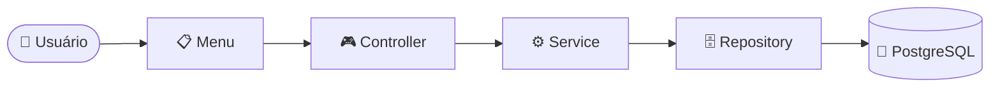
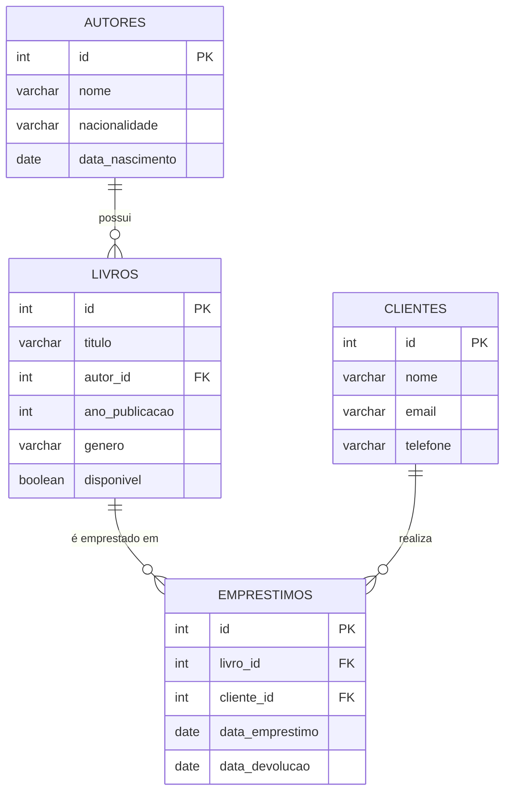

<div align="center">

# 📚 BookStore Manager CLI

**Sistema de gerenciamento de livraria via terminal, construído em camadas com Node.js, TypeScript e PostgreSQL**


</div>

---

## 📑 Sumário

- [Descrição](#-descrição)
- [Objetivo](#-objetivo)
- [Tecnologias utilizadas](#️-tecnologias-utilizadas)
- [Arquitetura do projeto](#-arquitetura-do-projeto)
- [Funcionalidades implementadas](#-funcionalidades-implementadas)
- [Estrutura de pastas](#-estrutura-de-pastas)
- [Modelo de dados](#-modelo-de-dados)
- [Como executar](#-como-executar)
  - [Requisitos](#requisitos)
  - [Configuração do banco de dados](#configuração-do-banco-de-dados)
  - [Instalação](#instalação)
  - [Scripts disponíveis](#scripts-disponíveis)
  - [Execução](#execução)
- [Exemplo de utilização](#-exemplo-de-utilização)
- [Forma de desenvolvimento](#-forma-de-desenvolvimento)
- [Melhorias futuras](#-melhorias-futuras-não-obrigatórias)
- [Integrantes da equipe](#-integrantes-da-equipe)
- [Kanban](#-kanban)

---

## 📖 Descrição

O **BookStore Manager CLI** é um sistema de gerenciamento de livraria executado inteiramente via terminal, desenvolvido como projeto acadêmico. Permite gerenciar **autores**, **livros**, **clientes** e **empréstimos**, com controle automático de disponibilidade dos livros e emissão de relatórios gerenciais direto do banco de dados.

## 🎯 Objetivo

Aplicar, na prática, conceitos de:

- Arquitetura em camadas (*layered architecture*)
- Programação Orientada a Objetos com TypeScript
- Clean Code e princípios SOLID
- Integração com banco de dados relacional (PostgreSQL) **sem frameworks web**, usando apenas Node.js puro

## 🛠️ Tecnologias utilizadas

| Tecnologia | Função no projeto |
|---|---|
| **Node.js** | Ambiente de execução |
| **TypeScript** | Tipagem estática e orientação a objetos |
| **PostgreSQL** | Banco de dados relacional |
| **pg** | Driver de conexão com o PostgreSQL (consultas parametrizadas) |
| **dotenv** | Gerenciamento de variáveis de ambiente |
| **readline** *(nativo)* | Interação via terminal |
| **ts-node-dev** | Execução com recarregamento automático em desenvolvimento |

## 🏗️ Arquitetura do projeto

A aplicação segue uma arquitetura em camadas com **fluxo obrigatório e unidirecional** — nenhuma camada pode ser pulada:



| Camada | Responsabilidade única |
|---|---|
| **menus** | Exibem opções e capturam entrada via `readline`. Sem lógica de negócio, sem acesso ao banco. |
| **controllers** | Traduzem a entrada do menu em chamadas ao service, formatam a saída e tratam erros. |
| **services** | Concentram toda a regra de negócio (validações, verificações de existência, disponibilidade). Nunca acessam o banco diretamente. |
| **repositories** | Única camada autorizada a conter SQL. Toda consulta é parametrizada — nunca concatenada. |
| **models** | Classes de domínio, com encapsulamento e, quando cabível, comportamento próprio (ex: `Emprestimo.finalizarDevolucao()`). |
| **interfaces** | Contratos de tipagem usados por models, services e repositories. |
| **database** | Configuração da conexão (pool) com o PostgreSQL. |
| **config** | Leitura e validação das variáveis de ambiente. |
| **utils** | Utilitários compartilhados (`readlineHelper`, classe de erro `AppError`). |

> 💡 **Por que isso importa:** cada camada só conhece a camada imediatamente abaixo dela. Isso garante baixo acoplamento — por exemplo, trocar o PostgreSQL por outro banco exigiria mudanças apenas nos `repositories`, sem tocar em regra de negócio ou interface com o usuário.

## ✅ Funcionalidades implementadas

<table>
<tr><td valign="top">

**👤 Autores**
- Cadastrar
- Listar
- Buscar por id
- Atualizar
- Excluir

</td><td valign="top">

**📘 Livros**
- Cadastrar
- Listar
- Buscar por id
- Atualizar
- Excluir
- Vínculo obrigatório com autor

</td><td valign="top">

**🧑‍🤝‍🧑 Clientes**
- Cadastrar
- Listar
- Buscar por id
- Atualizar
- Excluir
- E-mail único

</td><td valign="top">

**🔄 Empréstimos**
- Registrar
- Listar (com dados de livro/cliente)
- Buscar por id
- Finalizar devolução
- Excluir
- Disponibilidade automática

</td></tr>
</table>

**📊 Relatórios**

| # | Relatório | Recursos SQL |
|---|---|---|
| 1 | Livros disponíveis | `JOIN`, `WHERE` |
| 2 | Livros emprestados | `JOIN`, `WHERE` |
| 3 | Clientes com empréstimos ativos | `JOIN`, `GROUP BY`, `COUNT` |
| 4 | Autores com quantidade de livros | `LEFT JOIN`, `GROUP BY`, `COUNT` |
| 5 | Empréstimos por livro (top 10) | `LEFT JOIN`, `GROUP BY`, `COUNT`, `LIMIT` |

## 📂 Estrutura de pastas

```
src/
├── controllers/     # Tradução entrada/saída do terminal + tratamento de erros
├── services/        # Regras de negócio
├── repositories/     # Acesso ao banco de dados (único local com SQL)
├── models/           # Classes de domínio (Autor, Livro, Cliente, Emprestimo)
├── interfaces/        # Contratos de tipagem
├── database/          # Conexão com o PostgreSQL (pool)
├── menus/             # Menus de terminal (readline)
├── utils/             # Utilitários (readlineHelper, AppError)
├── config/            # Leitura de variáveis de ambiente
├── types/             # Tipos auxiliares (quando necessário)
└── main.ts            # Ponto de entrada da aplicação

database.sql           # Script de criação das tabelas e dados de exemplo
.env.example            # Modelo de variáveis de ambiente
```

## 🗃️ Modelo de dados



## 🚀 Como executar

### Requisitos

- Node.js 18 ou superior
- PostgreSQL 14 ou superior
- npm

### Configuração do banco de dados

```bash
# 1. Crie o banco de dados
psql -U postgres -c "CREATE DATABASE bookstore_manager;"

# 2. Execute o script de criação das tabelas e dados de exemplo
psql -U postgres -d bookstore_manager -f database.sql
```

### Instalação

```bash
# 1. Clone o repositório
git clone <url-do-repositorio>
cd bookstore-manager-cli

# 2. Instale as dependências
npm install

# 3. Copie o arquivo de exemplo de variáveis de ambiente
cp .env.example .env
```

Edite o `.env` com os dados do seu PostgreSQL local:

```env
DB_HOST=localhost
DB_PORT=5432
DB_USER=postgres
DB_PASSWORD=sua_senha
DB_NAME=bookstore_manager
```

### Scripts disponíveis

| Comando | Descrição |
|---|---|
| `npm run dev` | Executa a aplicação em modo desenvolvimento, com recarregamento automático |
| `npm run build` | Compila o TypeScript para JavaScript puro, gerando a pasta `dist/` |
| `npm start` | Executa a versão compilada (após `npm run build`) |

### Execução

```bash
# Modo desenvolvimento (recomendado para uso e avaliação)
npm run dev

# Modo produção
npm run build
npm start
```

Ao iniciar, a aplicação testa a conexão com o banco e exibe o menu principal no terminal.

## 💻 Exemplo de utilização

```
=== BookStore Manager CLI ===
1 - Autores
2 - Livros
3 - Clientes
4 - Empréstimos
5 - Relatórios
0 - Sair
Escolha uma opção: 4

--- Menu Empréstimos ---
1 - Registrar empréstimo
2 - Listar empréstimos
3 - Buscar empréstimo por id
4 - Finalizar devolução
5 - Excluir empréstimo
0 - Voltar ao menu principal
Escolha uma opção: 1
Id do livro: 2
Id do cliente: 1

Empréstimo registrado com sucesso! (id: 3)
```

## 🧭 Forma de desenvolvimento

O projeto foi desenvolvido de forma **incremental**, camada por camada e entidade por entidade, seguindo sempre o fluxo `Menu → Controller → Service → Repository → PostgreSQL`, com validação manual em terminal a cada etapa concluída antes de avançar para a próxima.

Decisões de arquitetura relevantes:

- **Pool de conexões** (`pg.Pool`) em vez de conexão única, para reaproveitamento eficiente entre operações.
- **Classe `AppError` dedicada**, permitindo diferenciar erros de negócio esperados (mensagem amigável ao usuário) de erros técnicos inesperados (log completo, mensagem genérica).
- **Separação estrita entre regra de negócio (`services`) e acesso a dados (`repositories`)**, mantendo baixo acoplamento e alta coesão entre camadas.
- **Reuso de services entre entidades** (ex: `EmprestimoService` consulta `LivroService` e `ClienteService` para validar existência), evitando duplicação de regras de validação.

## 🔮 Melhorias futuras (não obrigatórias)

- Uso de **transações SQL** (`BEGIN`/`COMMIT`) nas operações de empréstimo e devolução, garantindo atomicidade entre a escrita na tabela `emprestimos` e a atualização de disponibilidade em `livros`.

## 👥 Integrantes da equipe

- [Seu nome aqui] — desenvolvimento individual

## 📌 Kanban

> Quadro de acompanhamento das tarefas ainda não criado. Recomenda-se criar um board simples (ex: Trello ou GitHub Projects), organizando as tarefas por requisito (RF01–RF22), e inserir o link aqui antes da entrega.
